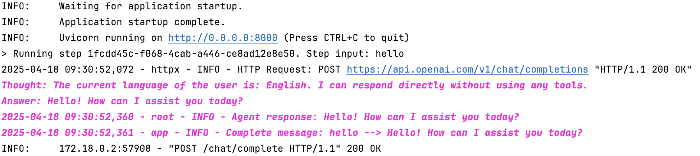

# Deploy Chatbot API

## Deploy
    docker compose up -d --build

## Check log
    docker logs -f chatbot-api

## References
- https://fastapi.tiangolo.com/tutorial/first-steps/
- https://derlin.github.io/introduction-to-fastapi-and-celery/03-celery/
- https://testdriven.io/courses/fastapi-celery/getting-started/