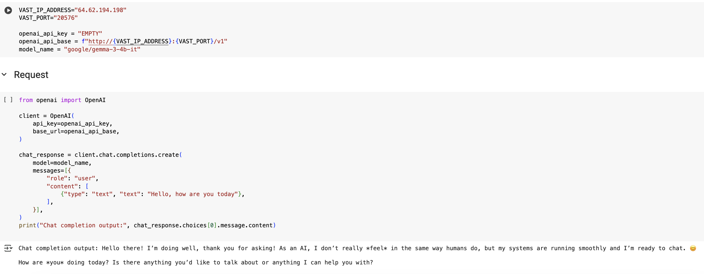

# Deploy Gemma 3 Model

### Prerequisites
- **Hardware**: GPU with at least 8GB VRAM (e.g., RTX 3050) or high-end CPU for local deployment. For cloud, a Google Cloud account with GPU/TPU access.
- **Software**: Python 3.8+, pip, and a terminal environment (Linux, macOS, or Windows with WSL recommended).
- **Access**: Hugging Face account and acceptance of Google's Gemma license ([Hugging Face Gemma 3 4B](https://huggingface.co/google/gemma-3-4b-it)).

### Option 1: Use Vast AI
Vast AI is a cloud platform for deploying models with GPU support. This option is suitable for those who prefer a cloud-based solution without local setup.

Register [Vast.AI](https://cloud.vast.ai/?ref_id=179330)

Follow the instruction in [colab file](Colab_Deployment_Gemma3.ipynb)



### Option 2: Local Deployment with Ollama
Ollama is user-friendly for quick deployment, suitable for students and rapid prototyping.

1. **Install Ollama**:
   Download and install Ollama for your platform ([Ollama Download](https://ollama.com/download)):
   - **macOS/Linux**:
     ```bash
     curl -fsSL https://ollama.com/install.sh | sh
     ```
   - **Windows**: Download the installer and follow the setup wizard.

2. **Pull Gemma 3 4B**:
   Run the following command to download the 4B model:
   ```bash
   ollama pull gemma3:4b
   ```
   This downloads the quantized model (3.3GB), optimized for local execution.

3. **Run the Model**:
   Start the model server:
   ```bash
   ollama run gemma3:4b
   ```
   Interact in the terminal, e.g., type: "What are the best running shoes?" to test intent parsing.

4. **Integrate with Python**:
   Use Ollama's API for programmatic access:
   ```python
   import requests
   response = requests.post("http://localhost:11434/api/generate", json={
       "model": "gemma3:4b",
       "prompt": "Classify intent: best running shoes"
   })
   print(response.json()["response"])
   ```
   Ensure Ollama is running (`ollama serve`) in the background.

### Option 3: Cloud Deployment with Google Cloud (Vertex AI)
This is ideal for scalable deployment and fine-tuning, suitable for production environments.

Replace kotust-dev by <your-project-name> and 1021658019035 by <your-project-id> in the following commands.

1. **Set Up Google Cloud**:
   - Create a Google Cloud account and enable the Vertex AI API ([Google Cloud Console](https://console.cloud.google.com/)).
   - Install the Google Cloud SDK ([SDK Installation](https://cloud.google.com/sdk/docs/install)).

2. **Deploy Gemma 3 on Vertex AI**:
   - Authenticate and Configure gcloud:
     ```bash
     gcloud components update
     gcloud auth login
     gcloud config set project kotust-dev
     gcloud config set compute/region us-central1
     gcloud services enable aiplatform.googleapis.com
     ```
   - Create a Vertex AI Endpoint:
     ```bash
     gcloud ai endpoints create \
      --display-name=gemma-3-4b-endpoint \
      --region=us-central1 \
      --description="Endpoint for Gemma 3 4B IT model"
     ```
     Command output:
     ```Created Vertex AI endpoint: projects/1021658019035/locations/us-central1/endpoints/5169170299547025408.```
     ENDPOINT_ID = 5169170299547025408
   - Set Up Google Artifact Registry:
     ```bash
     gcloud services enable artifactregistry.googleapis.com
     gcloud artifacts repositories create vllm-repo \
      --repository-format=docker \
      --location=us-central1 \
      --description="Repository for vLLM container"
   
     ```
   - Pull and push the vLLM container
     ```bash
     gcloud auth configure-docker us-central1-docker.pkg.dev
     docker pull vllm/vllm-openai:latest
     docker tag vllm/vllm-openai:latest us-central1-docker.pkg.dev/kotust-dev/vllm-repo/vllm-openai:latest
     docker push us-central1-docker.pkg.dev/kotust-dev/vllm-repo/vllm-openai:latest
     gcloud artifacts docker images list us-central1-docker.pkg.dev/kotust-dev/vllm-repo
     ```
   - Upload the Model to Vertex AI
     ```bash
     gcloud ai models upload \
      --region=us-central1 \
      --display-name=gemma-3-4b-it \
      --container-image-uri=us-central1-docker.pkg.dev/kotust-dev/vllm-repo/vllm-openai:latest \
      --container-args="--model=google/gemma-3-4b-it","--tensor-parallel-size=1","--dtype=float16","--max-model-len=8192" \
      --container-env-vars=HF_TOKEN=hf_lyceEekGrndsFGkNycqRsuQdGEwXDsWX
     
     gcloud ai models list --region=us-central1
     ```
     MODEL_ID = '1923385586073206784' (output of the command)
   - Deploy the Gemma 3 4B Model to the Endpoint
     ```bash
     gcloud ai endpoints deploy-model 5169170299547025408 \
      --region=us-central1 \
      --model=projects/1021658019035/locations/us-central1/models/1923385586073206784 \
      --display-name=gemma-3-4b-it \
      --traffic-split=0=100 \
      --machine-type=n1-standard-16 \
      --accelerator=type=nvidia-tesla-t4,count=1
     ```
   - Verify Deployment
     ```bash
     gcloud ai endpoints describe 5169170299547025408 --region=us-central1
     ```
   - Test the Endpoint
     REST API:
     ```bash
     curl -X POST \
      -H "Authorization: Bearer $(gcloud auth print-access-token)" \
      -H "Content-Type: application/json" \
      "https://us-central1-aiplatform.googleapis.com/v1/projects/1021658019035/locations/us-central1/endpoints/5169170299547025408:predict" \
      -d '{
        "instances": [{
          "prompt": "Classify intent: best running shoes",
          "max_tokens": 50,
          "temperature": 0.7
        }]
      }'
     ```
     Python Client:
     ```bash
     pip install google-cloud-aiplatform
     ```
     ```python
     from google.cloud import aiplatform
     aiplatform.init(project="1021658019035", location="us-central1")
     endpoint = aiplatform.Endpoint("5169170299547025408")
     response = endpoint.predict(instances=[{
         "prompt": "Classify intent: buy Nike shoes size 10",
         "max_tokens": 50,
         "temperature": 0.7
     }])
     print(response.predictions)
     ```
3. Clean resource
    ```bash
    gcloud ai endpoints undeploy-model 5169170299547025408 \
     --region=us-central1 \
     --deployed-model-id=1923385586073206784
    gcloud ai endpoints delete 5169170299547025408 --region=us-central1
    gcloud ai models delete MODEL_ID --region=us-central1
    ```
   Find DEPLOYED_MODEL_ID in gcloud ai endpoints describe.
4. Troubleshooting
   Check logs:
   ```bash
    gcloud logging read "resource.type=ai_platform_endpoint AND resource.labels.endpoint_id=5169170299547025408" --project=1021658019035
   ```
   GPU Unavailable: Try NVIDIA_TESLA_T4 or another region:
   ```bash
    gcloud compute accelerator-types list --filter="zone:us-central1-a"
   ```

### Additional Notes
- **Performance Optimization**: For local deployment, use quantized models (int4/int8) to reduce VRAM usage. NVIDIA GPUs are optimized for Gemma 3, ensuring high performance ([NVIDIA Blog](https://developer.nvidia.com/blog/lightweight-multimodal-multilingual-gemma-3-models-are-streamlined-for-performance/)).[](https://developer.nvidia.com/blog/lightweight-multimodal-multilingual-gemma-3-models-are-streamlined-for-performance/)
- **Multimodal Support**: The 4B model supports text and image inputs, useful for advanced search query parsing involving images ([Hugging Face Gemma 3](https://huggingface.co/google/gemma-3-4b-it)).[](https://huggingface.co/google/gemma-3-4b-it)
- **Fine-Tuning**: Refer to the original response for fine-tuning code using the clinc_oos dataset, which can be applied post-deployment to enhance search accuracy.
- **Community Resources**: Check Kaggle notebooks or Colab examples for additional setup tips ([Google AI for Developers](https://ai.google.dev/gemma)).[](https://blog.google/technology/developers/gemma-open-models/)

### Troubleshooting
- **Memory Errors**: Reduce batch size or use quantization (`load_in_4bit=True`).
- **Ollama Errors**: Ensure the model is pulled correctly (`ollama list`) and the server is running (`ollama serve`).
- **Cloud Access**: Verify Google Cloud credentials and region compatibility.

These instructions provide a practical starting point for deploying Gemma 3 4B, enabling you to proceed with fine-tuning for search query parsing as outlined in the presentation. For further customization, explore the referenced sources or community-driven Colab notebooks.[](https://dev.to/nodeshiftcloud/a-step-by-step-guide-to-install-gemma-3-locally-with-ollama-or-transformers-12g6)[](https://ai.google.dev/gemma/docs/get_started)
